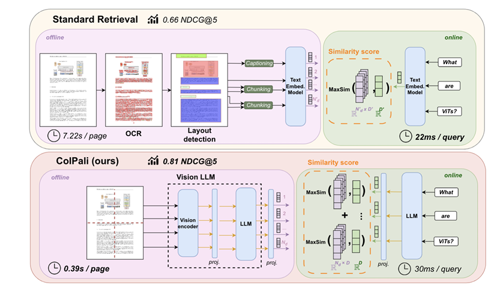
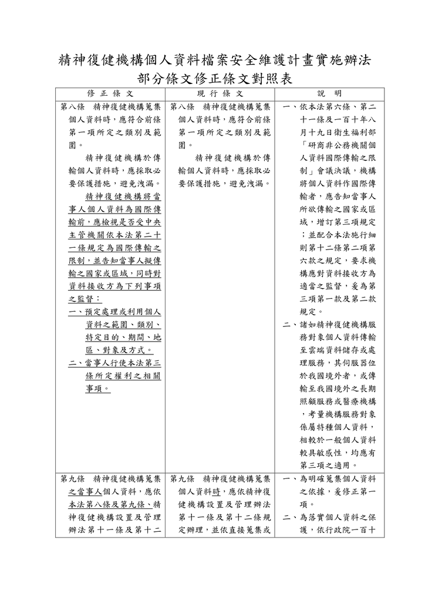
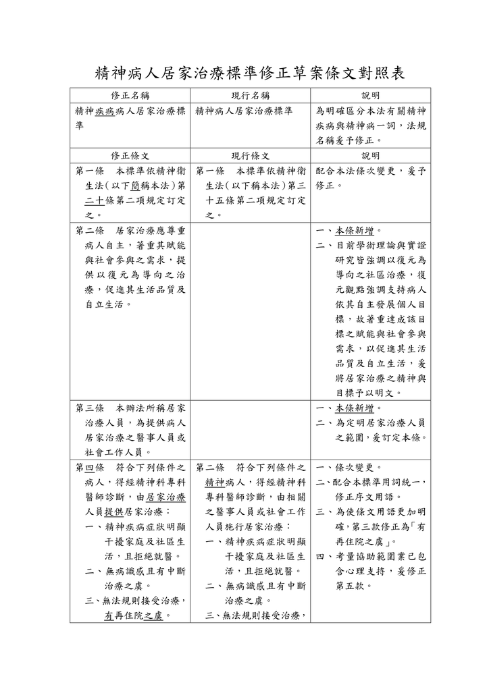

# ColPali Fine-tuning

ColPali is a multimodal retrieval model designed for document-level retrieval over text and images, enabling fine-grained semantic matching in OCR-heavy and layout-rich documents.



## Results

### Performance Improvement

Fine-tuning ColPali-v1.3 on domain-specific data significantly improves retrieval performance:

| Metric | Before Fine-tuning | After Fine-tuning | Improvement |
|--------|-------------------|-------------------|-------------|
| Recall@1 | 0.50 | 0.83 | +66% |
| Recall@5 | 0.79 | 0.95 | +20% |
| NDCG@5 | 0.63 | 0.91 | +44% |

### Example Query

**User Query**: 在提及「精神衛生法」的文件中，條文的依據變更了哪個條次？

<table>
<tr>
<td width="50%">
<b>Before fine-tuning:</b><br>

</td>
<td width="50%">
<b>After fine-tuning:</b><br>

</td>
</tr>
</table>

## Requirments

```bash
pip install -r requirements.txt
```

## How to use

```bash
# finetune with default config
python core/finetune_colpali.py

# finetune with custom config
python core/finetune_colpali.py configs/custom_config.yml
```

## Configuration File Structure

The YAML configuration file is organized into five sections:

### 1. Model Configuration

```yaml
model:
  name: "/path/to/model"
  quantization_strategy: "4bit"  # Options: "4bit", "8bit", null
```

### 2. Data Configuration

```yaml
data:
  path: "data/example.json"
  test_size: 0.2  # Proportion for test split (0.0-1.0)
  seed: 42        # Random seed for reproducibility
```

### 3. Training Configuration

```yaml
training:
  output_dir: "core/colpali-finetune/checkpoints"
  num_train_epochs: 3
  per_device_train_batch_size: 4
  per_device_eval_batch_size: 4
  gradient_accumulation_steps: 4
  learning_rate: 1.0e-4
  warmup_steps: 1
  logging_steps: 20
  save_total_limit: 5
```

### 4. Inference Configuration

```yaml
inference:
  run_pre_training: true   # Run inference before training
  run_post_training: true  # Run inference after training
  n_examples: 3            # Number of examples for inference
```

### 5. Debug Configuration

```yaml
debug:
  dir: null  # Set to a directory path to enable debug output
```


## Details

**Architecture**

ColPali follows a PaLiGemma + Projector + ColBERT design for multimodal retrieval.

```
PaLiGemma (SigLIP + SentencePiece, Gemma 2B)  
→ Projector (vision–text alignment)  
→ ColBERT (late-interaction retrieval)
```

**Features**

- **Contrastive Learning** - Match queries with correct document images
- **Multi-modal** - Process both text and images
- **LoRA** - Efficient training with fewer parameters
- **4-bit Quantization** - Run on consumer GPUs

**Training Method**

* Type: Contrastive learning
* Loss function: `ColbertPairwiseCELoss`
* Loss:

  ```python
  loss = F.softplus((neg_scores - pos_scores) / temperature).mean()
  ```
* **Hard negatives**:

  * Selected from top-1 / top-2 retrieval predictions
  * Use top-2 when top-1 equals the positive:

    ```python
    neg_scores = torch.where(top2[:, 0] == pos_scores, top2[:, 1], top2[:, 0])
    ```
